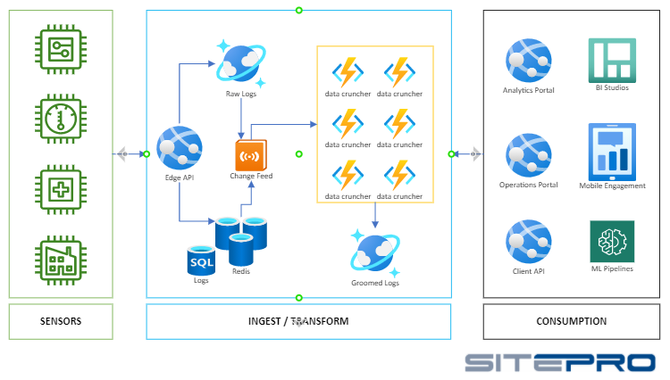
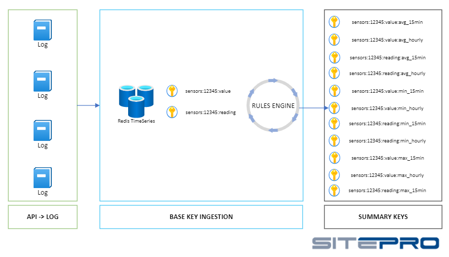
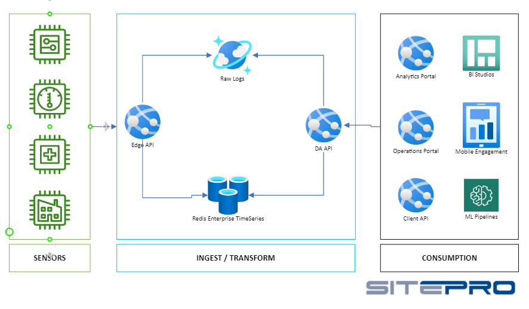

# Real-Time analysis at scale with Redis Enterprise TimeSeries Module
---
## Current
Currently IoT sensors in the field that monitor & feed intelligent control systems for equipment such as pumps generate logs based on various events & time intervals.

SitePro ingest data constantly from 100,000's of thousands of various sensors.  SitePro's various platforms (operations portals, mobile apps, command centers) leverage this large data set to employ decision makers with precise and up to date analytics with visualizations and realtime intelligent observations.

Downstream systems and pipelines rely on this data set to generate better insights and increase the quality of the analysis as a whole.

---
## Terms Used
* Data Cruncher - an Azure Function or Web Job that has a specific data point to groom and update specific time range interval log series.
* Groomed Data - in this context, refers to predefined collections of data broken into specific units of time (15min, 1hr, 1day)
* Log Attributes - the readings of interest that the data crunchers are concerned with (readings, timestamps)
* Summary Points - the aggregation of attributes for a given time range represented for each attribute (MAX, MIN, STDEV, AVG, COUNT, SUM)
* SitePro Platforms - SitePro's front line offerings that customers interact with to view, modify, visualize.


---
## Legacy Ingesting Workflow
The ingest occurs at an Edge API that in turn sinks the raw log data into a SQL Server or CosmosDB databases.  New data points that are ingested in SQL are added to a Redis list for processing by their respective data cruncher 
There is a notification sent to a series of azure functions and that there is a new or updated log.  

The cloud workers then will analyze the new data point and perform it's duties to prepare groomed data.

This process continues as new logs are generated or historical logs are edited.  The end result is a single data point that represents each unit of time with summary points for all attributes.  

---
## Legacy Impact
### The Good
This approach dramatically improved the effectiveness and efficiency downstream consumption of this data. Analytics systems can now offer the same precision in the form of 1 data point for any given range of time.  This same level of data is exposed to clients for ingestion into their internal systems as well.  A pattern we have grown and expanded on.

### The Not So Good
The operational aspects of maintaining state across the groomed data sets compared to the raw logs presents some challenges.  These operational efficiencies pose the threat of inconclusive or incorrect data to other intelligent systems responding or people interacting with said data in any of the platforms.
* what happens when a data cruncher fails
* what happens when we need to resample large modifications
* what happens when the function cannot scale fast enough

With this storage and ETL process we encounter some fixed and variable costs.  The initial downsides to this approach include:
* Encountered cost for the application service that crunches the data continously
* Logs stored in CosmosDB and SQL.  This slows down the efficiency of database management, restores, and disk consumption.
* Groomed Data is stored in Cosmos in it's respecitive time interval bucket (15 min, 1 hr, 1 day) and this adds fixed costs for each repository as well as the RU fees for throughput to the collection (reading/writing)





---
## Enter Redis Enterprise TimeSeries
After discussion with Redis Labs it was brought to SitePro's attention that there is an Enterprise version of Redis available and supported as a first class citizen in the Azure ecosystem.  The potential of the TimeSeries Module coupled with the long standing durability and performance of Redis could in fact be a drop in replacement with instant architectural and operational benefits.  
* Logs not stored in SQL Server and Cosmos, just raw logs in Cosmos
* Elimination of Groomed Data CosmosDB databases
* Elimination of Functions and Cloud services that managed this ETL

---
## POC Phase
With Redis delivering real-time infrastructure across the enterprise the TimeSeries module was attractive but needed to check off a lot of important requirements before fitting into our archticture.
* High Availability (99.99%)
* Geographically Distributed
* Ingest ability to replace Groomed Data in CosmosDB
* Proper community support (npm, nuget) and tooling 
* Platform ability to contain raw logs as well as downsampled intervals representing our Groomed Data Series time buckets
* Platform ability to calculate summary points 

After spinning up our first Redis Enterprise instance in Azure we were able to begin working and started ingesting data on the same day.  

## Resources Used
* Redis Enterpise - TimeSeries
* Node.js (RedisTimeSeries npm modules, Express)
* RedisInsight
* Azure (Docker containers, .net 5)
* CosmosDB
* Storage Calculator

---
## Redis TimeSeries Preperation
The Redis Community and Redis Labs proved invaluable for the rapid adoption of the TimeSeries transistion for us.  Our expectations of what was possible upon learning of this module did not line up all the way One-to-One.  As we dove into the exploritory and requirements phase of adoption there were many edge cases that we needed to make sure TimeSeries module handled or we could accomodate.  For example, handling time frames across timezones and what approach do they use when calculating summary data points across a unit of time.  Much work had been invested in our time-weighted summary points (AVG) that we had to test.  Another area of exploration was defining the key topology that represented attributes appropriately.

Redis TimeSeries module was ready for eveything we could think of that we had previously implemented.

The features in the TimeSeries module that make this possible:
* Redis Keys
* Redis Rules (and the corresponding Redis Keys)
* Built in summary functionality
    - Aggregation.AVG
    - Aggregation.SUM
    - Aggregation.MIN
    - Aggregation.MAX
    - Aggregation.COUNT
    - Aggregation.STDS
* Built in label features for necessary analysis across all keys (some examples)
    - Facility Name
    - Location Data
    - ID (MRANGE for id we can pull back all of it's stuff)
    - MFG Name
    - Model Number
* Duplication policy options

---
## Success

### Raw Log 
```json
"DataLog": {
        "ID": 12345,
        "Date": 131729271617100000,
        "Facility": 98765,
        "Value": 1296.1001520408959,
        "Reading": 1399.020370794234,
        "Others ...": "NA"
    }
```

### Legacy Groomed Data In CosmosDB
The raw logs are converted by the data crunchers and their time interval databases contained a single object that represented.  This process leaves us with a summarized object.

```json
"15MIN_DataLog": {
        "ID": 12345,
        "Date": 131729271617100000,
        "Facility": 98765,
        "Value":  {
            "SUM": 2423423,
            "AVG": 1344.324,
            "MAX": 1832.443,
            "MIN": 998.34,
            "COUNT": 5,
            "STDEV": 276.23502
        },
        "Others ...": {
            "SUM": 0,
            "AVG": 0,
            "MAX": 0,
            "MIN": 0,
            "COUNT": 0,
            "STDEV": 0
        }
    }
```

### Key Topology, Rules, and Labels
For us flattening out the structured storage of the logs as data points was critical to the extraction of data for consumption.  Previously we had relied on resting JSON objects that contained all the datapoints we needed.  For us, the approach was simple as scoping the keys to the type of log we were handling, followed by unique attributes and lastly the attribute we are storing.

1.  Define Keys that represent each attribute to send raw log values.
Using our raw log example as the basis we would need to create 2 keys.
    - sensors:12345:value
    - sensors:12345:reading

With this we recognize our key topology provides a linear path to the value while giving us some context as well.  This is a base instance of the key.
    - {type}:{id}:{attribute}

2.  The keys themselves would be enough to perform aggregrations in real time against but we are looking to streamline access to units of measurement deamed important in our Platforms (15min, 1hr) for each possible attribute on the logs.  This means we need to create rules for base instance of keys that we have.  It is IMPORTANT to remember that if we create a rule then we will have to create keys where Redis TimeSeries can sink data as a result of a rule execution; these are our summary keys.  

To recreate our legacy system in the TimeSeries we need to create summary keys and rules for:
- TimeIntervals
    - 15min
    - 1hr
- Attributes
    - value
    - reading
- Summaries
    - Average
    - Min
    - Max
    - Count
    - Standard Deviation

Resulted in these summary keys that we added:
- sensors:12345:value:avg_15min
- sensors:12345:value:avg_hourly
- sensors:12345:reading:avg_15min
- sensors:12345:reading:avg_hourly
- sensors:12345:value:min_15min
- sensors:12345:value:min_hourly
- sensors:12345:reading:min_15min
- sensors:12345:reading:min_hourly
- sensors:12345:value:max_15min
- sensors:12345:value:max_hourly
- sensors:12345:reading:max_15min
- sensors:12345:reading:max_hourly
- sensors:12345:value:stdv_15min
- sensors:12345:value:stdv_hourly
- sensors:12345:reading:stdv_15min
- sensors:12345:reading:stdv_hourly
- sensors:12345:value:count_15min
- sensors:12345:value:count_hourly
- sensors:12345:reading:count_15min
- sensors:12345:reading:count_hourly

3.  Defining rules to offload the data crunchers workload to the Redis Enterprise engine
Frontloading all the base keys, rules, and summary keys was achieved using Node.JS and the redistimeseries-js npm package.  Defining rules is done at our base key level.  This way any upserts of data to that key will execute the rules in a reactive and realtime manner.  For us, in JavaScript, we create the rules after both the base key and summary keys have been created. 

It is important to note that rules can be added to any key but will not backfill data on the key.  Only data reacted to after the rule creation will have any impact on our summary keys.

```javascript
    await rtsClient
        // key that rule is being attached to, key that any reactive downstream data is sunk
        .createRule(`sensors:${id}:${attribute.toLowerCase()}`, `sensors:${id}:${attribute.toLowerCase()}:avg_hourly`)
        .aggregation(Aggregation.AVG, 3600000)  // <---- RULE DEFINITION, leverage built in Aggregation options with time intervals desired
        .send().catch((error) => {
          console.error(error);
        }).then(async (results) => {
          return true;
        });

      await rtsClient
        // key that rule is being attached to, key that any reactive downstream data is sunk
        .createRule(`sensors:${id}:${attribute.toLowerCase()}`, `sensors:${id}:${attribute.toLowerCase()}:avg_15min`)
        .aggregation(Aggregation.AVG, 900000)  // <---- RULE DEFINITION, leverage built in Aggregation options with time intervals desired
        .send().catch((error) => {
          console.error(error);
        }).then(async (results) => {
          return true;
        });
```



4.  Labels and Duplicates
Labels can be added to keys so entries can be grouped together across just one keyset.  For example, in many cases, we need to review all data at a particular location or across device manufactorers. For duplicates in this case we are simply taking the LAST entry.    

```javascript
    let labels = {
      id: id,
      facility: facility,
      project: project,
      client: client,
      part: part,
      mfg:mfg
    };

      await rtsClient.create(key = `sensors:${id}:${attribute.toLowerCase()}`, duplicatePolicy = 'LAST', labels = labels).send().catch((error) => {
        console.error(error);
      }).then(async (results) => {
        return true;
      });   
```

---
## The New New




---
## Consuming our new Data
There are already wonderful tools like Grafana that provide direct connectivity to the 


We have also begun to rollout a data access layer that wraps access to the time series data.  This allows us to create composite models on the fly for highly targeted attribute selection.  In addition to the preset data series around the base keys and the summary keys we needed the ability to decorate some of the data meta data.  Another benefit of having a lean wrapper data layer around the timeseries data is that we can leverage more out of the box functionality from the Redis TimeSeries engine.

* Query by start time and end-time
* Query by labels sets
* Aggregated queries (Min, Max, Avg, Sum, Range, Count, First, Last) for any time bucket


## API EXAMPLE

* Show object composition from buckets to decorate a single objects


## RealTime Example of Analytics In Action

* Show "Enterprise Intel" from SitePro Command Center.


---
## Surprises
* data compression, foot print from previous storage to Redis TimeSeries for us improved by 65%
* better data transport, with the TimeSeries DAL we can specify model attributes on the fly instead of having a concrete resting JSON object

## Next Steps

---
## Conclusion
* Cost analysis
* Throughput Analytics
* Architecture impacts
* Data integrity Impact
* ML and Downstream pipeline Impacts

